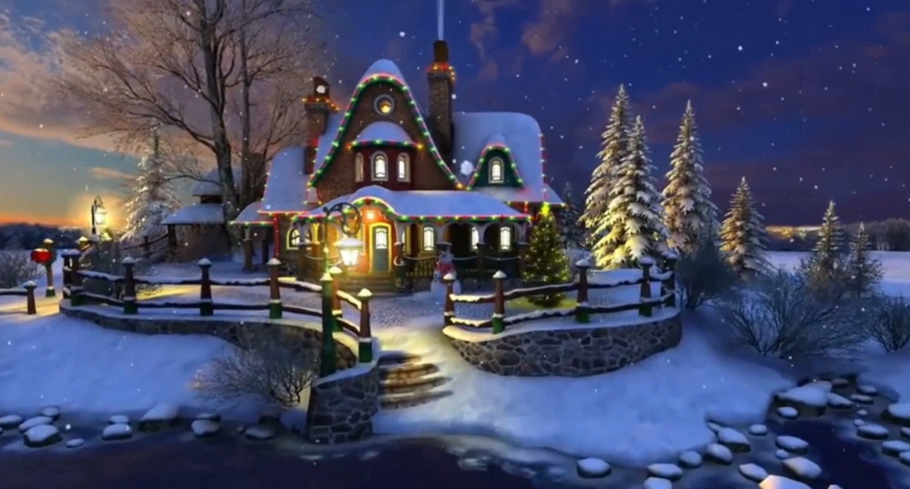
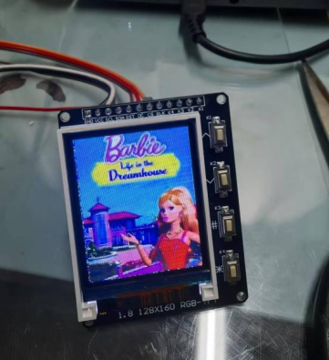

# Barbie's Dream House

**This is the official code of Barbie's Dream House project.**

Barbie Dream House is a pink memory of countless girls' childhoods, symbolizing dreams, beauty, and longing. Riding the wave of digitalization and intelligence, as a female computer major, I hope to blend this innocent dream with cutting-edge technology. 

Adhering to the philosophy of integrating humanistic romance with technological core, I am committed to creating a Barbie Dream House for the AI era. This is not only a tribute to childhood memories but also an innovative exploration in the field of smart homes. I expect to use artificial intelligence, the Internet of Things and other modern technologies to give Barbie's house a new life, making it not only beautiful in appearance but also safe, comfortable, warm and full of technological charm in its inner quality.

## YouTube Overview

